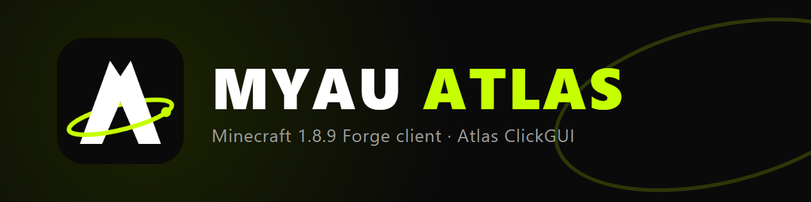
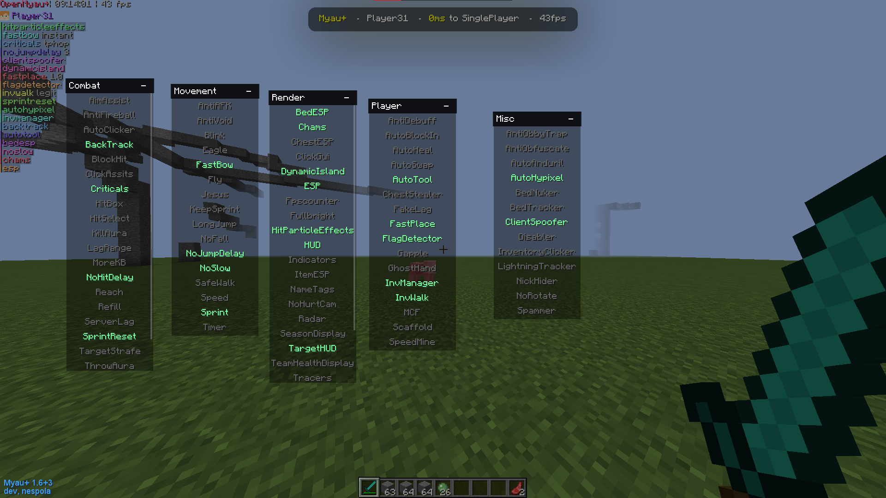
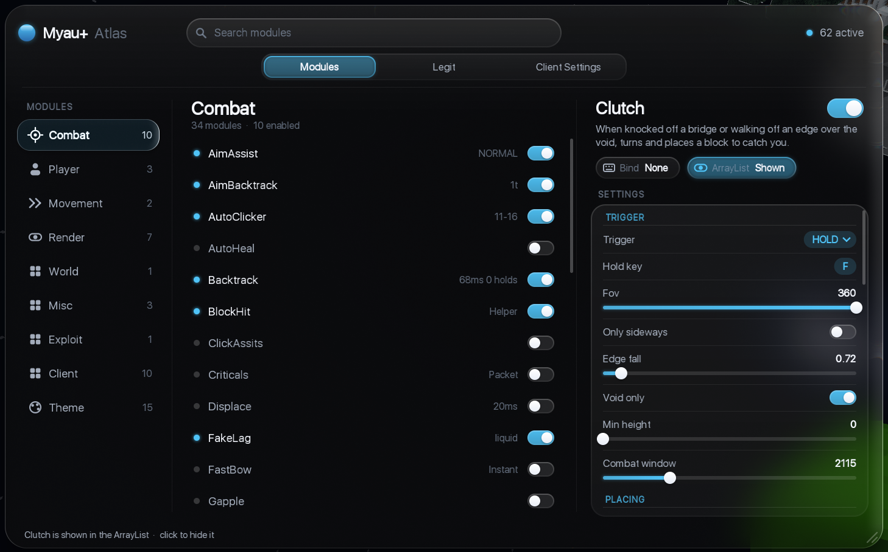
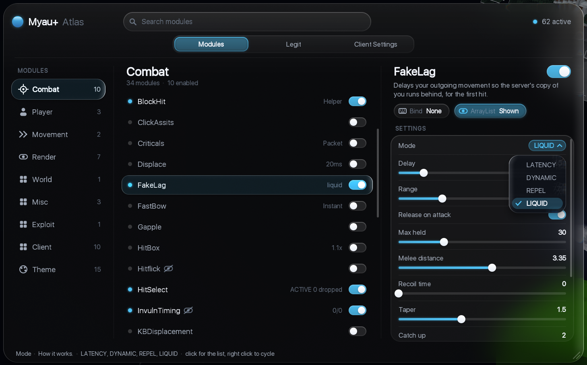
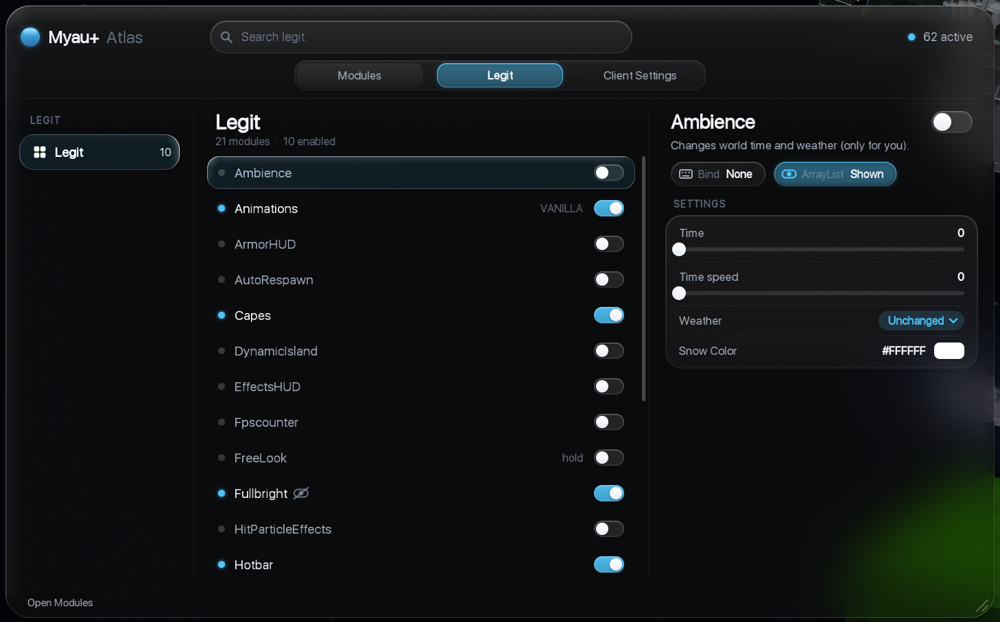

<p align="center"></p>

# OpenMyau+ (fork)

[](https://discord.gg/SNPC2TcM8v)



A Minecraft 1.8.9 Forge client, forked from
[IamNespola/OpenMyau-Plus](https://github.com/IamNespola/OpenMyau-Plus) (itself based on OpenMyau).
This fork reworks many modules and adds diagnostics, all measured against real game logs.

> **Use it only where it is allowed** — singleplayer, your own server, or test servers that permit clients like this.
> Using it on servers whose rules forbid it can get your account banned. You are responsible for how you use it.

[中文說明](#中文說明)

## What is different in this fork

- **Clutch** — catches falls and knock-offs by placing blocks under you. Plans each catch from a simulated fall path,
  builds short chains when a cell is out of reach, can hang ladders, and has a `safe-mode` that makes big turns a tick
  before the click (the server sees the look first) without slowing continuous placement.
- **AutoBlockIn**, **Scaffold** fixes (keep-y, tower, multi-place off by default).
- **KillAura** audit fixes: CPS, hitbox checks, smooth turn-back in every rotation mode.
- **Rotation engine** with adjustable speed noise, curved paths and easing (`Rotations` module).
- **FlagDetector** — reads server corrections, refused placements and damage cuts ("mitigation"), and attributes
  each one to the module most likely responsible. Writes per-session logs under `config/Myau/`.
- **PlayTracker** HUD — play time, games played and a mitigation indicator.
- **Atlas ClickGUI** — every module and setting has a description, in Chinese or English
  (Client Settings → Language); Chinese text is drawn with Noto Sans SC. Light / Dark mode for the menu and the HUD.
- **HUD Editor** — open it from the Atlas header and drag HUD elements into place (snapping, arrow-key nudges).
- 230+ unit tests.

`docs/ENGINEERING-NOTES.md` is the full development log: what was measured, what changed and why. Read it before
changing a module.

## Atlas ClickGUI

| Modules and settings | Mode dropdown |
|---|---|
|  |  |



Search, categories, a Legit tab, per-module descriptions and grouped settings with hints.
Client Settings holds the theme and the language (中文 / English).

## Community

Join the Myau Atlas Discord for downloads, help, bug reports and suggestions: **https://discord.gg/SNPC2TcM8v**

## Building

Requires JDK 17 to run Gradle (the mod itself targets Java 8).

```bash
./gradlew build
```

The jar is written to `build/libs/`. Put it in the `mods` folder of a Minecraft 1.8.9 Forge instance.

## License

GPL-3.0, the same as the upstream project. See [LICENSE](LICENSE). This fork is a modified version of
OpenMyau-Plus; changes are described in `docs/ENGINEERING-NOTES.md`.

Fonts and other assets under `src/main/resources` were inherited from upstream and keep their own licenses.

---

## 中文說明

Minecraft 1.8.9 Forge 客戶端，fork 自 [IamNespola/OpenMyau-Plus](https://github.com/IamNespola/OpenMyau-Plus)。
這個分支重寫、修正了很多模組，並加上用實際遊戲 log 驗證的診斷工具。

> **只在允許的地方使用**：單人、自己的伺服器，或允許這類客戶端的測試伺服器。在禁止的伺服器上使用可能被封號，後果自負。

Discord 社群（下載、問題、回報 bug、建議）：**https://discord.gg/SNPC2TcM8v**

主要內容：
- **Clutch**：被打下去或掉落時自動放方塊接住。可開 `safe-mode`，大角度轉頭會提早一個 tick，不降低連續放置速度。
- **AutoBlockIn**、**Scaffold** 修正（keep-y、tower、multi-place 預設關）。
- **KillAura** 修正：CPS、碰撞箱檢查、所有轉頭模式的平滑回轉。
- **轉頭引擎**：可調速度隨機、弧線、減速（`Rotations` 模組）。
- **FlagDetector**：偵測伺服器拉回、被退回的方塊、減傷（mitigation），並推估是哪個模組造成的。
- **PlayTracker** HUD：遊玩時間、場數、減傷提示。
- **Atlas 點擊選單**：每個模組和設定都有中英文說明（Client Settings → Language），中文用思源黑體繪製；選單與 HUD 支援淺色／深色模式。
- **HUD 編輯器**：從 Atlas 標題列打開，直接拖曳 HUD 位置（自動對齊、方向鍵微調）。

開發紀錄在 `docs/ENGINEERING-NOTES.md`。

Atlas 點擊選單的截圖在上面的「Atlas ClickGUI」段落。

編譯：需要 JDK 17，執行 `./gradlew build`，jar 會在 `build/libs/`。

授權：GPL-3.0（與上游相同）。
